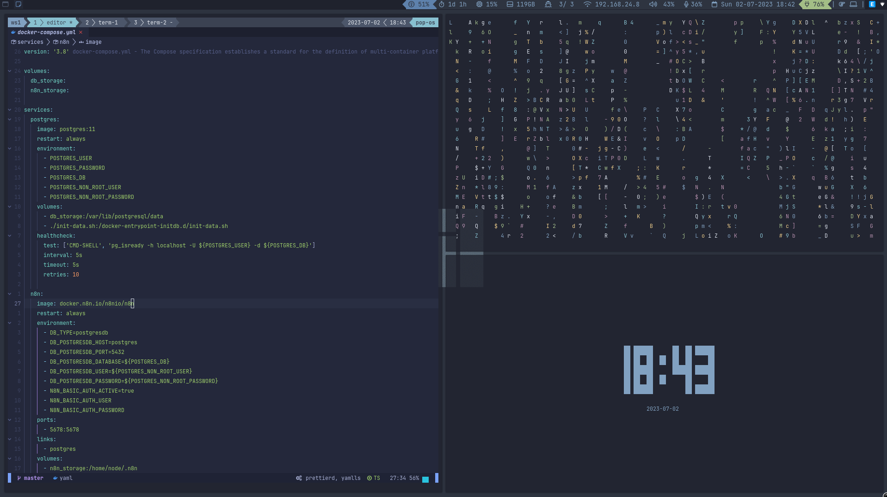

# dotfiles
My own dot files ( picking up idea from different places work for me tho) 

## Themes and Fonts

+ Font Awesome 6
+ Jetbrains Mono (inspired by syntax fm)
+ Nord Themes Palette ( It's nord or nothing)

## Package Requires

+ [Neovim] (https://neovim.io/)
+ [alacritty] (https://github.com/alacritty/alacritty)
+ [tmux] (https://github.com/tmux/tmux)
+ [I3 ( lastest version )] (https://i3wm.org/)
+ [I3-status-rust](https://github.com/greshake/i3status-rust)
+ [Font Awesome 6] (https://fontawesome.com/download)
+ [I3lock-color] (https://github.com/Raymo111/i3lock-color)
+ [dunst] (https://github.com/dunst-project/dunst) 
+ [Rofi] (https://github.com/davatorium/rofi)
+ [Picom] (https://github.com/yshui/picom)
+ [feh] (https://feh.finalrewind.org/)
+ [lxappearance] (https://github.com/lxde/lxappearance)
+ [arandr] (https://github.com/haad/arandr)
+ [pavucontrol] (https://freedesktop.org/software/pulseaudio/pavucontrol/)
+ [maim] (https://github.com/naelstrof/maim)
